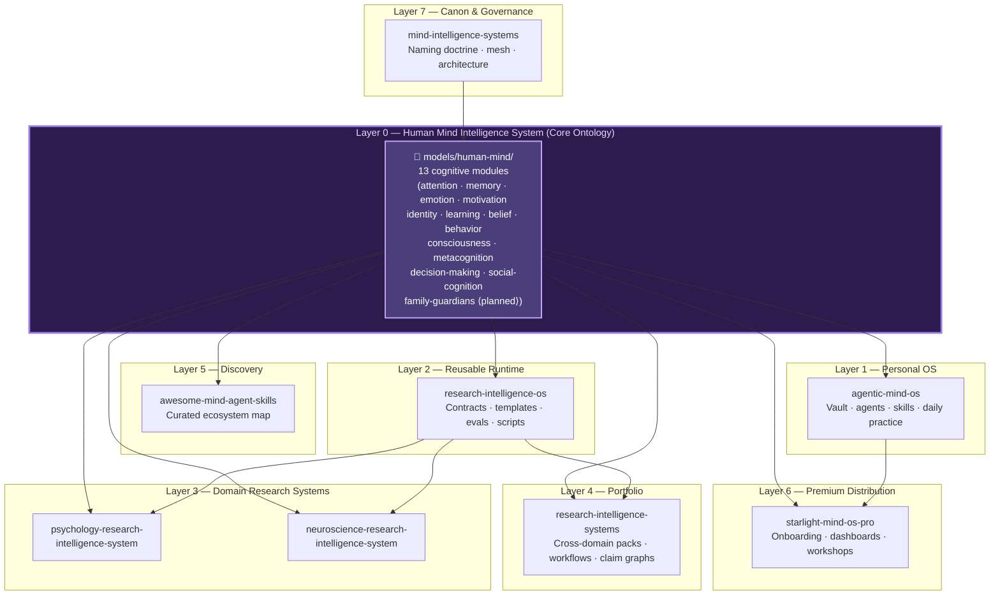

# Architecture

Mind Intelligence Systems is a layered portfolio built on a shared cognitive ontology.

## Layer Diagram

---

## Layer Descriptions

### Layer 0 — Human Mind Intelligence System (Core Ontology)

**Path**: `models/human-mind/`
**Role**: The canonical ontology for all cognitive, affective, and behavioural constructs in the swarm.

This is the most foundational layer. Every agent prompt, schema property, and domain construct that refers to human cognition or behaviour **must** use terminology anchored here. The HMIS ensures that `working memory` in Agentic Mind OS refers to the same construct as `working memory` in the Neuroscience Research Intelligence System.

Modules: `attention`, `memory`, `emotion`, `motivation`, `identity`, `learning`, `belief`, `behavior`, `consciousness`, `metacognition`, `decision-making`, `social-cognition`, `family-guardians` *(planned)*.

### Layer 1 — Personal OS

**Agentic Mind OS**: The practitioner's daily interface to the swarm. Vault-based, agent-powered, skill-driven. Consumes all 12 active HMIS modules to power mind-cartographer agents, review sessions, and personal canon.

### Layer 2 — Reusable Runtime

**Research Intelligence OS**: Pipeline contracts, agent contracts, evaluation protocols, and templates. The scaffold on which domain systems are built. Grounds pipeline stages in HMIS terminology (e.g., a "belief updating" pipeline stage maps to `belief.md`).

### Layer 3 — Domain Research Systems

- **Psychology Research Intelligence System**: Constructs, evidence synthesis, psychometrics, qualitative analysis. Consumes all 11 behavioural/cognitive HMIS modules.
- **Neuroscience Research Intelligence System**: BIDS/NWB/MNE pipelines, neurodata, reproducibility. Consumes attention, memory, emotion, consciousness, decision-making modules.

### Layer 4 — Portfolio Layer

**Research Intelligence Systems**: Cross-domain packs, multi-study workflows, claim graphs. Bridges domain systems; uses HMIS as shared vocabulary for cross-domain construct alignment.

### Layer 5 — Discovery

**Awesome Mind Agent Skills**: Curated ecosystem map. Uses HMIS module names as the taxonomy for tagging discovered tools, papers, skills, and MCP servers.

### Layer 6 — Premium Distribution

**Starlight Mind OS Pro**: Commercial UX, onboarding, dashboards, workshops. Derives UX copy and worksheet vocabulary from HMIS motivation, identity, behavior, and learning modules.

### Layer 7 — Canon & Governance

**Mind Intelligence Systems** *(this repo)*: Naming doctrine, mesh, architecture governance, and the HMIS itself. The only repo that can define or modify HMIS modules.

---

## Family Guardian Agent Tier (Planned)

The **Family Guardian** tier is a forthcoming specialised agent layer built on top of the HMIS `social-cognition` and planned `family-guardians` modules. It addresses relational care, family system dynamics, and guardian role support as distinct workstreams within Agentic Mind OS:

- `family-guardian-cartographer` — maps relational roles and care responsibilities
- `family-guardian-planner` — converts care insights into scheduled actions
- `family-guardian-reviewer` — periodic reflection sessions on guardian effectiveness

These agents consume `social-cognition.md` (theory of mind, norms, intergroup dynamics) and the new `family-guardians.md` module (care dynamics, dependency mapping, protective factors).

---

## Key Contracts

- **MindPack**: packaging standard for agents, skills, workflows, schemas, vaults.
- **ResearchPack**: packaging standard for research systems.
- **Agent contracts and pipeline contracts**: defined in Research Intelligence OS.
- **HMIS Ontology Contract**: defined in `models/human-mind/` (this repo); governs terminology across all contracts above.

---

## Data & Privacy

- Local-first vaults for personal data (Agentic Mind OS).
- Source-grounded research artifacts (domain systems).
- JSON Schema for interoperability (planned: `models/human-mind/schemas/`).
- Family Guardian data treated with highest privacy tier: local-only, no cloud sync without explicit consent.

---

## Agent Interaction Model

All repos are designed for:
- Codex / Claude Code / Gemini / Hermes agents
- `.codex/tasks.md` queues
- `AGENTS.md` and `HERMES.md` for context
- Issue templates for task intake
- **HMIS module files as ground-truth system prompt fragments**

See individual repo ARCHITECTURE or README for domain specifics.
