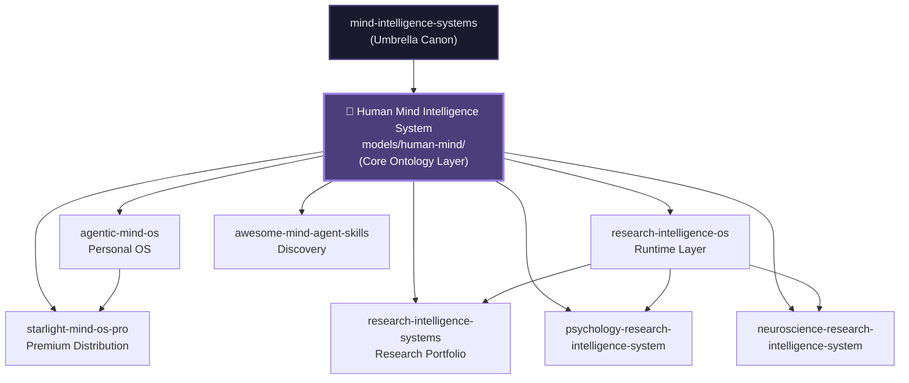

# Repo Mesh

This document defines the connections and data flows between the Mind Intelligence Systems repositories.

---

## ⚙️ Human Mind Intelligence System — Core Ontology Layer

> **`models/human-mind/` is the single source of truth for every cognitive, affective, and behavioral construct in the entire swarm. Every repo that reasons about human experience, learning, psychology, or behaviour MUST import from this layer. It is not optional.**

The **Human Mind Intelligence System** (HMIS) lives at `mind-intelligence-systems/models/human-mind/` and acts as the canonical ontology layer. It defines 13 modular constructs:

| Module | Domain | Primary Consumers |
|--------|--------|--------------------|
| `attention.md` | Selective & executive attention | agentic-mind-os, PRIS, NRIS |
| `memory.md` | Working, episodic, semantic, procedural | agentic-mind-os, PRIS, NRIS, RIS |
| `emotion.md` | Affect, appraisal, regulation | agentic-mind-os, PRIS |
| `motivation.md` | Goal pursuit, self-determination, volition | agentic-mind-os, RIS, Starlight |
| `identity.md` | Self-concept, narrative identity | agentic-mind-os, Starlight |
| `learning.md` | Acquisition, consolidation, transfer | agentic-mind-os, PRIS, NRIS, RIS |
| `belief.md` | Epistemic states, revision, bias | agentic-mind-os, PRIS, RIS |
| `behavior.md` | Habit, action, implementation intentions | agentic-mind-os, PRIS, Starlight |
| `consciousness.md` | Awareness, self-monitoring | agentic-mind-os, NRIS |
| `metacognition.md` | Thinking about thinking | agentic-mind-os, PRIS, RIS |
| `decision-making.md` | Dual-process, prospect theory, choice | agentic-mind-os, PRIS, NRIS, RIS |
| `social-cognition.md` | Theory of mind, norms, intergroup | agentic-mind-os, PRIS, family-guardians |
| `family-guardians.md` *(planned)* | Relational safety, care dynamics, guardian roles | agentic-mind-os, family-guardian-agents |

**Rule**: Any agent prompt, schema, or workflow that names a cognitive or behavioural construct must use the exact terminology from the module above. Drift from this terminology is a governance violation.

---

## Ontology Dependency Diagram



---

## Core Repos and Responsibilities

| Repo | Role | Primary Manifest | Key Outputs | Consumes HMIS? |
|------|------|------------------|-------------|----------------|
| **mind-intelligence-systems** | Umbrella canon & HMIS | repo-mesh.yaml | Doctrine, models, architecture | ✅ Defines it |
| **agentic-mind-os** | Personal OS | mindpack.yaml | Vaults, agents, skills, workflows | ✅ All modules |
| **research-intelligence-systems** | Research portfolio | researchpack.yaml | Packs, cross-domain workflows | ✅ Core modules |
| **research-intelligence-os** | Reusable runtime | research-os.yaml | Runtime contracts, templates, evals | ✅ Schemas |
| **psychology-research-intelligence-system** | Psychology vertical | psychologyresearch.yaml | Psych agents, skills, schemas | ✅ All modules |
| **neuroscience-research-intelligence-system** | Neuroscience vertical | neuroresearch.yaml | Neuro agents, BIDS/MNE skills | ✅ Neuro-relevant modules |
| **awesome-mind-agent-skills** | Ecosystem discovery | (none) | Curated awesome lists | ✅ Reference only |
| **starlight-mind-os-pro** | Premium distribution | starlight-pro.yaml | Onboarding, dashboards, workshops | ✅ UX-facing modules |

---

## Data Flows

### Ontology Propagation (HMIS → All)
Every repo in the swarm imports construct definitions from `models/human-mind/`. This ensures:
- Agent prompts use consistent vocabulary (e.g., "working memory" not "short-term store")
- Schema properties align across domain boundaries
- Research constructs in PRIS/NRIS map to the same ontological anchors

### Operational Flows
- **Agentic Mind OS** consumes skills/workflows from Research Intelligence OS and domain systems; grounds its vault prompts in HMIS modules.
- **Research packs** in Research Intelligence Systems feed into domain systems (PRIS, NRIS).
- **Research Intelligence OS** exports runtime contracts and templates that PRIS and NRIS build on, all referencing HMIS terminology.
- **Awesome list** surfaces external tools that can be wrapped as MindPacks, referencing HMIS as the tagging taxonomy.
- **Starlight Pro** packages outputs from Agentic Mind OS for customers; UX copy and worksheets derive vocabulary from HMIS.
- **Family Guardian Agents** (planned tier) consume `social-cognition.md` and a forthcoming `family-guardians.md` module to support relational care workflows.

### Change Propagation
```
HMIS module update → MIS PR → cross-repo issues in all consumers → aligned PRs
```

---

## Governance

Changes to naming, architecture, or core models require updates here and PRs across dependent repos.

**HMIS governance rules**:
1. Never rename a module without a deprecation cycle across all consumers.
2. Never introduce a construct in a consumer repo without first anchoring it in HMIS.
3. Agent prompts that reference cognitive constructs must cite the HMIS module filename.

See also: `repo-mesh.yaml`
