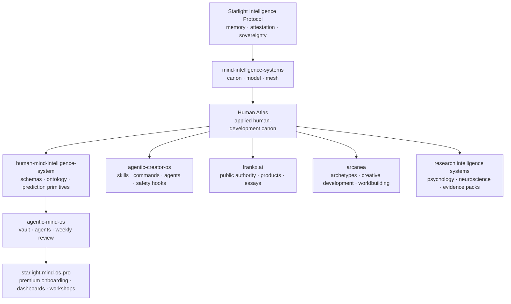

# Human Atlas

**Status**: canonical system design draft  
**Date**: 2026-07-06  
**Layer**: canon  
**Composes**: Starlight Intelligence Protocol (SIP), Mind Intelligence Systems, Human Mind Intelligence System  
**Scope**: non-clinical human development, self-understanding, agentic reflection, learning, leadership, creativity, and behavior change

---

## 0. Intent

The **Human Atlas** is the expanded developmental map for the Mind Intelligence Systems portfolio.

It does not replace the existing twelve-module human-mind model. It sits one level above it as the richer applied atlas: the map of qualities, values, patterns, needs, sensitivities, shadows, skills, habits, communication tendencies, leadership defaults, learning preferences, and growth edges that agents can observe, structure, and reflect back without collapsing into diagnosis.

The existing human-mind model answers:

> "Which cognitive, affective, and behavioral construct is active?"

The Human Atlas answers:

> "What kind of human pattern is expressing here, what evidence supports that reading, what development move is available, and which repo should operationalize it?"

The design principle is simple: **a human is not a type**. A human is a living system of capacities, constraints, protections, motives, environments, wounds, habits, meanings, and chosen futures.

---

## 1. Non-negotiable boundary

The Human Atlas is not a therapy engine, diagnostic classifier, pathology inventory, or disorder map.

Every agent, schema, vault template, product surface, and research workflow must keep these five stages separate:

```text
observation -> interpretation -> hypothesis -> evidence -> decision
```

The system may say:

> "You repeatedly describe high autonomy needs, low tolerance for bureaucratic friction, and fast recovery when given self-directed work."

The system must not say:

> "You have X disorder" or "This is treatment."

Human-owned decisions remain sovereign. Agents may support reflection, prioritization, pattern recognition, and experiment design. They do not diagnose.

---

## 2. Architectural position



The Human Atlas belongs first in `mind-intelligence-systems` because it is canonical vocabulary. It is then operationalized as schemas and ontology in `human-mind-intelligence-system`, lived through `agentic-mind-os`, productized through `starlight-mind-os-pro` and `frankx.ai`, mythopoetically expressed through `arcanea`, and executed by `agentic-creator-os` skills and commands.

---

## 3. Core ontology

The Human Atlas has five layers.

### 3.1 Asset layer

What gives a person agency, excellence, resilience, and contribution.

- Core Qualities
- Values
- Virtues
- Talents
- Skills

### 3.2 Drive layer

What moves a person toward action, meaning, repair, belonging, status, mastery, love, freedom, or transcendence.

- Motivations
- Needs

### 3.3 Style layer

How a person tends to move through the world when unstressed, under pressure, learning, leading, creating, relating, or deciding.

- Personality Traits
- Communication Styles
- Leadership Styles
- Learning Styles

### 3.4 Pattern layer

What repeats across time.

- Emotional Patterns
- Habits
- Attachment Styles

### 3.5 Constraint layer

What distorts, protects, blocks, floods, avoids, overcompensates, or creates recurring failure modes.

- Shadow Qualities
- Pitfalls
- Cognitive Biases
- Defense Mechanisms
- Trauma Responses
- Allergies & Sensitivities
- Physical / Environmental Sensitivities

These layers are not ranked. Assets can become shadows. Needs can become virtues when honored or pitfalls when denied. Habits can be stabilizers or prisons. Leadership style can be a gift in one context and a tax in another.

---

## 4. Dimension contract

Every Human Atlas dimension uses the same canonical shape.

```yaml
id: human_atlas.dimension_id
label: Human-readable name
layer: asset | drive | style | pattern | constraint
definition: >
  Stable definition without diagnosis or moralizing.
developmental_function: >
  What this dimension helps a human do when integrated.
observable_signals:
  - What can be seen, written, said, chosen, repeated, avoided, built, or felt.
growth_edges:
  - Higher-agency expression.
shadow_distortions:
  - How the same pattern degrades under stress, shame, scarcity, fear, fatigue, or incoherent environment.
related_constructs:
  human_mind:
    - attention
    - emotion
    - motivation
  human_atlas:
    - other_dimension_id
evidence_requirements:
  minimum_observations: 3
  time_window: "prefer repeated signal across days/weeks unless explicitly stated as acute"
  confidence_rule: "interpretation confidence never exceeds observation confidence"
agent_usage:
  allowed:
    - reflective summary
    - pattern hypothesis
    - growth experiment
    - question generation
    - vault tagging
  forbidden:
    - diagnosis
    - disorder labeling
    - treatment advice
    - identity lock-in
    - coercive scoring
```

This contract prevents the usual failure mode: turning a developmental model into a personality prison.

---

## 5. Human Atlas dimensions

### 5.1 Core Qualities

**Layer**: asset  
**Definition**: Recurring strengths of being and action: courage, curiosity, devotion, discernment, humor, tenderness, precision, stamina, patience, creative fire, truthfulness, beauty-sense, generosity, protectiveness, play.

**Function**: Shows where the person already has energy, dignity, and leverage.

**Signals**:
- Repeated praise from others
- Work that becomes easier with use
- Energy rises after exertion
- The person defends this quality even when inconvenient
- It appears across domains without needing external reward

**Shadow distortion**:
- Courage becomes recklessness
- Precision becomes control
- Tenderness becomes collapse
- Humor becomes avoidance
- Protectiveness becomes domination

**Repo implementation**:
- Canon: `models/human-atlas/core-qualities.md`
- Schema: `schemas/human-atlas/core-quality.schema.json`
- Agentic Mind OS: quality inventory note template
- FrankX: authority essay / lead magnet section
- Arcanea: archetypal virtue matrix

---

### 5.2 Values

**Layer**: drive / asset  
**Definition**: Chosen or implicit priorities that determine trade-offs.

**Function**: Makes decisions legible. Values are not slogans; they are revealed by sacrifice.

**Signals**:
- What the person protects under pressure
- What they refuse even when rewarded
- What creates anger when violated
- What they optimize for when nobody is watching
- Which trade-off feels clean even when costly

**Shadow distortion**:
- Freedom becomes avoidance of commitment
- Excellence becomes contempt
- Loyalty becomes self-erasure
- Beauty becomes vanity
- Truth becomes cruelty
- Peace becomes passivity

**Repo implementation**:
- Canon value taxonomy
- Decision journal template
- Starlight memory tagging: `value:freedom`, `value:truth`, `value:craft`

---

### 5.3 Virtues

**Layer**: asset  
**Definition**: Trained moral-executive capacities: courage, temperance, wisdom, justice, compassion, honesty, humility, discipline, devotion, fidelity, patience.

**Function**: Converts value into embodied action over time.

**Signals**:
- Repeated action despite friction
- Self-correction without external punishment
- Wise restraint when impulse would be easier
- Repair after error
- Capacity to hold power without becoming extractive

**Shadow distortion**:
- Discipline becomes rigidity
- Humility becomes hiding
- Compassion becomes rescuing
- Justice becomes vengeance
- Devotion becomes obsession

**Repo implementation**:
- Human Atlas virtue cards
- Weekly review virtue traces
- Arcanea virtue-archetype bridge

---

### 5.4 Talents

**Layer**: asset  
**Definition**: Natural aptitudes or unusually fast-learning domains.

**Function**: Reveals asymmetric leverage.

**Signals**:
- Faster-than-peer acquisition
- Early pattern recognition
- Spontaneous practice
- Others seek the person for this ability
- Work feels native rather than forced

**Shadow distortion**:
- Talent creates arrogance, avoidance of fundamentals, identity fragility, or refusal to train weak links.

**Repo implementation**:
- Talent inventory
- Skill acquisition pathways
- Creator OS routing to agents/skills based on talent surface

---

### 5.5 Skills

**Layer**: asset / behavior  
**Definition**: Trainable capabilities with observable performance.

**Function**: Turns identity, talent, and motivation into external outcomes.

**Signals**:
- Output quality
- Repeatability
- Transfer across contexts
- Feedback improves performance
- Can be demonstrated, taught, or measured

**Shadow distortion**:
- Skill hoarding, brittle expertise, performative competence, over-specialization.

**Repo implementation**:
- Connect to Agentic Creator OS skill packs
- Add skill progression templates to Agentic Mind OS
- FrankX product ladder uses skill acquisition as transformation promise

---

### 5.6 Motivations

**Layer**: drive  
**Definition**: Internal and external forces that initiate, sustain, or redirect action.

**Function**: Explains movement.

**Signals**:
- What starts action without prompting
- What revives energy after fatigue
- What rewards feel meaningful
- What frustration reveals about blocked drive
- What future image pulls behavior forward

**Shadow distortion**:
- Achievement becomes self-worth dependency
- Belonging becomes conformity
- Autonomy becomes isolation
- Mastery becomes endless preparation
- Power becomes domination

**Repo implementation**:
- Extend motivation module with Human Atlas drive profiles
- Add vault prompt: "What moved me today?"
- Response-prediction primitive uses motivation only as a hypothesis, never as identity lock

---

### 5.7 Needs

**Layer**: drive / constraint  
**Definition**: Conditions required for regulation, functioning, growth, relationship, performance, and meaning.

**Function**: Explains what must be present before higher agency stabilizes.

**Signals**:
- Recurrent dysregulation when absent
- Ease when present
- Conflicts that repeat around the same missing condition
- Environment-person mismatch
- Body signals before cognitive explanation appears

**Need families**:
- Physiological: sleep, food, movement, sunlight, recovery
- Safety: predictability, boundaries, financial stability, physical safety
- Relational: attunement, respect, belonging, affection, autonomy-with-connection
- Cognitive: clarity, challenge, novelty, sense-making, feedback
- Creative: expression, beauty, play, myth, possibility
- Sovereign: choice, dignity, authorship, privacy

**Shadow distortion**:
- Denied needs become resentment, collapse, impulsivity, withdrawal, control, fantasy, or compulsive productivity.

---

### 5.8 Personality Traits

**Layer**: style  
**Definition**: Relatively stable tendencies in perception, affect, behavior, and social orientation.

**Function**: Offers probabilistic style hypotheses, not destiny.

**Signals**:
- Cross-context consistency
- Baseline energy pattern
- Social recovery needs
- Novelty tolerance
- order/chaos preference
- Emotional reactivity / stability
- Openness to abstraction and imagination

**Shadow distortion**:
- Trait language becomes excuse, stereotype, or identity cage.

**Repo implementation**:
- Keep model-agnostic; do not canonize one trait framework as total truth.
- Store as optional lens, not global label.

---

### 5.9 Shadow Qualities

**Layer**: constraint  
**Definition**: Disowned, overused, underdeveloped, or reactive forms of otherwise legitimate human energy.

**Function**: Shows where power has split from awareness.

**Signals**:
- Strong judgment toward others
- Repeating interpersonal ruptures
- Overreaction to ordinary triggers
- Talents used defensively
- Identity invested in being "not that"

**Shadow distortion**:
- The shadow is the distortion; do not moralize it. Interpret as displaced energy needing integration.

**Examples**:
- Disowned ambition
- Disowned anger
- Disowned tenderness
- Disowned need
- Disowned power
- Disowned play
- Disowned grief

**Repo implementation**:
- Agentic Mind OS: "shadow without shame" reflection template
- Arcanea: shadow archetype transformations
- Guardrail: no trauma excavation as entertainment

---

### 5.10 Pitfalls

**Layer**: constraint / behavior  
**Definition**: Predictable failure modes created by context, habit, fear, incentives, or unbalanced strengths.

**Function**: Makes risk actionable.

**Signals**:
- Repeated derailment pattern
- Known edge under stress
- "I always do this when..."
- Success creates the next failure condition
- Strength becomes single-point-of-failure

**Examples**:
- Overbuilding before validating
- Insight addiction without shipping
- People-pleasing
- Isolation under load
- Perfectionism
- Avoiding boring maintenance
- Chase-new-system drift

**Repo implementation**:
- Weekly review: "pitfall trigger -> protective move -> next experiment"
- ACOS: quality gate notices for known pitfall classes

---

### 5.11 Allergies & Sensitivities

**Layer**: constraint / environment  
**Definition**: Physical, sensory, environmental, or contextual sensitivities that materially affect regulation and performance.

**Function**: Prevents agents from interpreting environmental friction as character failure.

**Signals**:
- Recurrent energy drop in specific environments
- Food, light, sound, temperature, clutter, air, social density, or schedule affects cognition/body
- Body warning appears before mental story
- Performance changes dramatically with conditions

**Guardrail**:
Agents may track self-reported patterns. They must not diagnose allergies, medical conditions, intolerances, or prescribe treatment.

**Repo implementation**:
- Agentic Mind OS: environment log template
- Starlight: private/local vault entries only
- FrankX: do not productize private sensitivity data

---

### 5.12 Emotional Patterns

**Layer**: pattern  
**Definition**: Recurring sequences of affect, appraisal, body state, impulse, story, and action.

**Function**: Turns emotional life from noise into temporal pattern.

**Signals**:
- Emotion recurs around similar contexts
- Specific story appears with specific body state
- Predictable action follows feeling
- Recovery has known conditions
- Certain people/situations produce consistent loops

**Pattern shape**:

```text
trigger -> appraisal -> body state -> emotion -> impulse -> behavior -> consequence -> repair
```

**Shadow distortion**:
- Emotion becomes identity, proof, command, or enemy.

---

### 5.13 Attachment Styles

**Layer**: pattern / relationship  
**Definition**: Relational regulation patterns around closeness, distance, trust, rupture, repair, need, autonomy, and dependency.

**Function**: Helps agents reason about relationship patterning without clinical labeling.

**Signals**:
- Closeness-seeking under stress
- Distance-seeking under stress
- Protest behavior
- Fear of engulfment or abandonment
- Repair capacity after conflict
- Boundary clarity

**Guardrail**:
Use "attachment pattern hypothesis" rather than fixed style label unless the user self-identifies.

**Repo implementation**:
- Social-cognition bridge
- Relationship review notes
- Leadership and communication adapters

---

### 5.14 Cognitive Biases

**Layer**: constraint / belief / decision-making  
**Definition**: Systematic distortions in attention, memory, belief updating, probability judgment, and choice.

**Function**: Improves epistemic hygiene.

**Signals**:
- Selective evidence use
- Overweighting recent/salient information
- Escalating commitment
- Overconfidence
- Status-quo preference
- Narrative closure too early

**Repo implementation**:
- Extend decision-making and belief modules
- ACOS: `/decision-audit` or `/human-atlas audit-decision`
- Research systems: evidence-linked bias cards

---

### 5.15 Defense Mechanisms

**Layer**: constraint / protection  
**Definition**: Protective psychological strategies that reduce threat, shame, conflict, or overwhelm.

**Function**: Reframes "bad behavior" as protection that may have become outdated.

**Signals**:
- Intellectualizing instead of feeling
- Humor under vulnerability
- Minimizing needs
- Projection
- Rationalization
- Avoidance
- Control
- Idealization / devaluation

**Guardrail**:
Defense language must be tentative and evidence-bound. It should open compassion and agency, not become accusation.

---

### 5.16 Trauma Responses

**Layer**: constraint / nervous-system pattern  
**Definition**: Self-protective response patterns around perceived threat.

**Function**: Ensures agents do not shame survival responses or overinterpret behavior as personality.

**Signals**:
- Fight: attack, control, anger, force
- Flight: busyness, escape, overwork, optimization
- Freeze: shutdown, indecision, numbness
- Fawn: appeasement, compliance, self-abandonment
- Collapse: helplessness, energy loss, despair-like flattening

**Guardrail**:
Track only self-reported or clearly observed non-clinical patterns. No diagnosis, no trauma claims, no treatment protocols.

---

### 5.17 Habits

**Layer**: pattern / behavior  
**Definition**: Repeated cue-routine-reward loops, conscious or automatic.

**Function**: Converts insight into environmental design.

**Signals**:
- Consistent timing/cue
- Automatic sequence
- Reward or relief after behavior
- Resistance when blocked
- Identity story attached to routine

**Repo implementation**:
- Agentic Mind OS: habit ledger
- Starlight: operational vault patterns
- FrankX: product transformation pathways

---

### 5.18 Communication Styles

**Layer**: style / social-cognition  
**Definition**: Default way of exchanging meaning, conflict, feedback, requests, affection, and boundaries.

**Function**: Makes collaboration and relationship less mysterious.

**Signals**:
- Direct vs indirect speech
- Detail vs gist
- Conflict speed
- Feedback style
- Emotional explicitness
- Turn-taking pattern
- Written vs spoken preference

**Shadow distortion**:
- Direct becomes harsh
- Diplomatic becomes vague
- Analytical becomes cold
- Expressive becomes flooding
- Concise becomes withholding

---

### 5.19 Leadership Styles

**Layer**: style / behavior / social-cognition  
**Definition**: Default pattern of creating direction, safety, standards, momentum, decision rights, and accountability.

**Function**: Aligns role, team, context, and temperament.

**Signals**:
- How the person sets direction
- How they handle conflict
- How they delegate
- How they create standards
- How they respond to ambiguity
- How they metabolize authority

**Examples**:
- Architect
- Steward
- Commander
- Coach
- Catalyst
- Visionary
- Operator
- Guardian
- Teacher
- Diplomat

**Shadow distortion**:
- Architect becomes detached abstraction
- Guardian becomes overcontrol
- Visionary becomes chaos
- Coach becomes avoidance of command
- Operator becomes narrow execution

---

### 5.20 Learning Styles

**Layer**: style / learning  
**Definition**: Preferred conditions, modalities, feedback loops, and sequences for acquiring and integrating capability.

**Function**: Optimizes learning design without reducing the person to a simplistic style label.

**Signals**:
- Learn-by-building vs learn-by-reading
- Solo vs social learning
- Theory-first vs example-first
- Visual, auditory, kinesthetic, written preferences as situational aids, not fixed destiny
- Feedback intensity tolerance
- Need for challenge, play, structure, or apprenticeship

**Repo implementation**:
- Agentic Mind OS: learning profile
- AI Architect Academy: curriculum personalization
- FrankX: learning products and guided tracks

---

## 6. Mapping to the twelve human-mind constructs

| Human Atlas dimension | Primary constructs | Secondary constructs |
|---|---|---|
| Core Qualities | identity, behavior | motivation, social-cognition |
| Values | identity, belief, decision-making | emotion, behavior |
| Virtues | behavior, metacognition | identity, decision-making |
| Talents | learning, attention | identity, motivation |
| Skills | learning, behavior | memory, metacognition |
| Motivations | motivation | emotion, identity, decision-making |
| Needs | motivation, emotion | behavior, social-cognition |
| Personality Traits | identity, emotion | behavior, social-cognition |
| Shadow Qualities | identity, emotion | belief, behavior |
| Pitfalls | behavior, decision-making | attention, belief |
| Allergies & Sensitivities | emotion, attention | behavior, consciousness |
| Emotional Patterns | emotion | memory, belief, behavior |
| Attachment Styles | social-cognition, emotion | identity, behavior |
| Cognitive Biases | belief, decision-making | memory, attention |
| Defense Mechanisms | emotion, belief | identity, social-cognition |
| Trauma Responses | emotion, behavior | attention, consciousness |
| Habits | behavior | motivation, memory |
| Communication Styles | social-cognition | emotion, decision-making |
| Leadership Styles | social-cognition, decision-making | identity, behavior |
| Learning Styles | learning | attention, memory, motivation |

---

## 7. Profile model

A Human Atlas profile is not a scorecard. It is a living evidence map.

```yaml
profile_id: local_or_user_defined
created_at: ISO-8601
updated_at: ISO-8601
privacy: local_first
owner_decision_rights:
  export: human_only
  delete: human_only
  share: explicit_consent_only

observations:
  - id: obs_001
    date: ISO-8601
    source: daily_note | weekly_review | conversation | manual_entry | imported_artifact
    content: "Raw observation only."
    confidence: 0.0-1.0
    atlas_tags:
      - values.freedom
      - needs.autonomy
      - pitfalls.overbuilding

interpretations:
  - id: int_001
    observation_ids: [obs_001]
    statement: "Tentative interpretation."
    confidence: 0.0-1.0
    evidence_for: []
    evidence_against: []
    alternative_explanations: []

hypotheses:
  - id: hyp_001
    statement: "Developmental hypothesis."
    confidence: 0.0-1.0
    next_evidence_to_seek: []
    reversible: true

experiments:
  - id: exp_001
    hypothesis_id: hyp_001
    action: "Small reversible test."
    duration: "7 days"
    success_signal: "Observable change."
    review_date: ISO-8601

decisions:
  - id: dec_001
    human_decision: "What the human chose."
    rationale: "Why."
    linked_hypotheses: []
```

This shape should be mirrored across schemas, vault notes, commands, and product surfaces.

---

## 8. Agent loop

```text
Capture
  Raw note, artifact, journal line, conversation, decision, body/environment log.

Tag
  Mark possible Human Atlas dimensions without interpretation inflation.

Cluster
  Find recurrence across time, context, and source type.

Hypothesize
  Offer tentative pattern language with evidence and alternatives.

Experiment
  Design one small reversible growth move.

Review
  Compare expected vs observed outcome.

Update
  Strengthen, weaken, split, or retire the hypothesis.
```

No agent gets to skip from capture to identity claim.

---

## 9. Repository rollout matrix

| Repo | Role | Human Atlas responsibility |
|---|---|---|
| `mind-intelligence-systems` | Canon | Own `docs/HUMAN_ATLAS.md`, `models/human-atlas/`, atlas-to-mind construct mapping, mesh placement, naming doctrine. |
| `human-mind-intelligence-system` | Engineered System | Own JSON Schemas, ontology edges, response-prediction primitives, confidence/evidence rules. |
| `agentic-mind-os` | Lived OS | Own vault templates, daily/weekly prompts, human-atlas-cartographer agent, `/map-human-atlas`, `/review-human-atlas`. |
| `starlight-mind-os-pro` | Premium distribution | Own onboarding, dashboards, workshops, founder/practitioner templates, commercial packaging. |
| `Starlight-Intelligence-System` | Substrate | Own optional memory tags, attestation, vault storage guidance, MCP retrieval conventions; do not create a seventh vault unless proven necessary. |
| `agentic-creator-os` | Execution harness | Own `human-atlas-system` skill, routing rules, slash command, safety hooks for non-clinical language. |
| `frankx.ai-vercel-website` | Public authority | Own product/essay/lead-magnet pages, learning journey, creator-facing positioning. |
| `arcanea` | Creative universe | Own archetypal expression, character development, virtues/shadows as mythic progression, academy/worldbuilding bridges. |
| `ai-architect-academy` | Learning surface | Own learning-style adaptation, skills progression, leadership/cognitive-bias modules for AI architects. |
| `research-intelligence-os` | Research runtime | Own evidence ingestion contracts, claim cards, source grounding, evals. |
| `psychology-research-intelligence-system` | Psychology vertical | Own construct evidence packs, psychometric cautions, non-clinical summaries. |
| `neuroscience-research-intelligence-system` | Neuroscience vertical | Own brain/body/environment evidence, sensory/regulation research summaries, non-clinical constraints. |

---

## 10. Minimum file set

### Canon repo

```text
docs/HUMAN_ATLAS.md
models/human-atlas/README.md
models/human-atlas/index.yaml
models/human-atlas/dimensions/core-qualities.md
models/human-atlas/dimensions/values.md
models/human-atlas/dimensions/virtues.md
models/human-atlas/dimensions/talents.md
models/human-atlas/dimensions/skills.md
models/human-atlas/dimensions/motivations.md
models/human-atlas/dimensions/needs.md
models/human-atlas/dimensions/personality-traits.md
models/human-atlas/dimensions/shadow-qualities.md
models/human-atlas/dimensions/pitfalls.md
models/human-atlas/dimensions/allergies-sensitivities.md
models/human-atlas/dimensions/emotional-patterns.md
models/human-atlas/dimensions/attachment-styles.md
models/human-atlas/dimensions/cognitive-biases.md
models/human-atlas/dimensions/defense-mechanisms.md
models/human-atlas/dimensions/trauma-responses.md
models/human-atlas/dimensions/habits.md
models/human-atlas/dimensions/communication-styles.md
models/human-atlas/dimensions/leadership-styles.md
models/human-atlas/dimensions/learning-styles.md
```

### Engineered System repo

```text
schemas/human-atlas/profile.schema.json
schemas/human-atlas/observation.schema.json
schemas/human-atlas/dimension.schema.json
schemas/human-atlas/hypothesis.schema.json
schemas/human-atlas/experiment.schema.json
ontology/human-atlas.md
docs/human-atlas-response-prediction.md
```

### Lived OS repo

```text
vault-templates/human-atlas/README.md
vault-templates/human-atlas/profile.md
vault-templates/human-atlas/daily-capture.md
vault-templates/human-atlas/weekly-review.md
vault-templates/human-atlas/experiments.md
agents/human-atlas-cartographer.md
agents/growth-experiment-designer.md
commands/map-human-atlas.md
commands/review-human-atlas.md
```

### ACOS repo

```text
.claude/skills/human-atlas-system/SKILL.md
.claude/commands/human-atlas.md
.claude/agents/human-atlas-cartographer.md
skill-rules.json update
```

---

## 11. Product surface

The Human Atlas can become three product forms.

### 11.1 Personal operating system

A local-first self-understanding OS:

- daily capture
- weekly pattern review
- needs/environment tracking
- values/virtues inventory
- skills/talents map
- shadow/pitfall reflection
- growth experiments

### 11.2 Builder / leader intelligence

A founder/operator layer:

- leadership style
- communication defaults
- decision biases
- delegation patterns
- team friction patterns
- stress responses
- value conflicts
- energy architecture

### 11.3 Creative mythic atlas

An Arcanea layer:

- archetypal virtues
- shadow integration
- character development
- faction psychologies
- worldbuilding templates
- creative identity maps

These are different surfaces over one canon, not separate models.

---

## 12. Evaluation

A Human Atlas implementation is good when it improves:

- self-recognition without identity lock-in
- decision clarity
- behavioral experiment quality
- agent memory usefulness
- weekly review usefulness
- communication repair
- learning design
- leadership fit
- evidence discipline

A Human Atlas implementation is bad when it produces:

- fixed labels
- diagnosis
- shame
- mystical overreach
- generic self-help prose
- trait determinism
- data extraction without sovereignty
- unsupported confidence
- productized intimacy without consent

---

## 13. Acceptance criteria for first implementation

A first Codex pass is acceptable when:

1. `docs/HUMAN_ATLAS.md` exists as the canonical system design.
2. `models/human-atlas/index.yaml` lists all dimensions with IDs, layers, descriptions, and related constructs.
3. Each dimension has a markdown file following the dimension contract.
4. `repo-mesh.yaml` references Human Atlas under `models`.
5. `human-mind-intelligence-system` receives draft schemas for profile, observation, dimension, hypothesis, and experiment.
6. `agentic-mind-os` receives vault templates and at least one cartographer agent.
7. `agentic-creator-os` receives one skill and one command for using the atlas.
8. All outputs preserve the non-clinical boundary.
9. All claims are labelled observation, interpretation, hypothesis, evidence, or decision.
10. No private personal data is committed.

---

## 14. Decision posture

The correct first move is not to build an app.

The correct first move is to stabilize the canon, then generate schemas, then wire a local-first lived loop, then productize. Apps without canon become content. Canon without lived loop becomes shelfware. Lived loop without schema becomes vibes. Schema without product surface becomes invisible infrastructure.

The Human Atlas should therefore ship in this sequence:

```text
canon -> schemas -> vault loop -> agent commands -> product surfaces -> research evidence packs
```

Built on SIP. Human-owned. Evidence-bound. Non-clinical. Developmental, not diagnostic.
