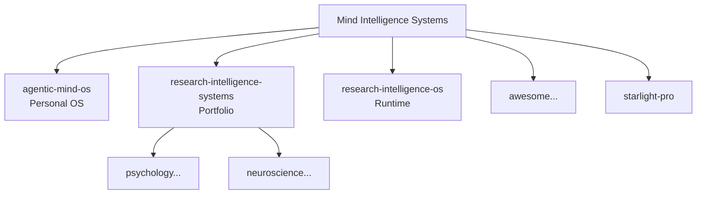

# Swarm Architecture & Experience

## Purpose
Mind Intelligence Systems is the umbrella for agentic systems that help humans understand, structure, improve, and extend learning, self-understanding, psychology, neuroscience, research, and human development.

## How People Experience the Swarm

Users primarily live in **agentic-mind-os** (personal daily driver).

They occasionally dip into domain systems for research depth or use Starlight Pro for guided setup.

Experience layers:
- **Lived daily**: Vault in agentic-mind-os
- **Research mode**: Packs + workflows in research-intelligence-systems + domain repos
- **Discovery**: awesome list
- **Premium polish**: Starlight

## How Agents Explore

Agents use:
- repo-mesh.yaml for map
- models/human-mind/* for ontology
- Cross-repo manifests for contracts
- .codex/tasks.md for work queues

Example: An agent in psychology system pulls the belief.md from human-mind model to ground constructs.

## Usefulness

- Consistent language across personal + scientific tools
- Reusable packs reduce reinvention
- Agent-readable by design
- Foundation for commercial (Pro) and open discovery

See the HTML diagram in assets/diagrams/.

## Mermaid Overview (render in GitHub or Obsidian)

